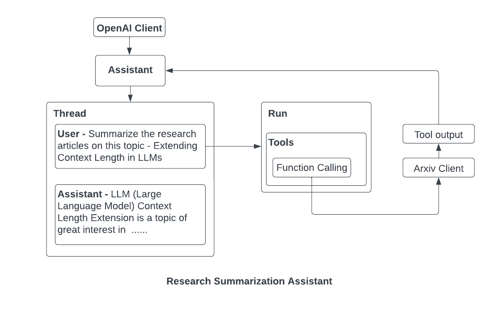

I this project, I've leveraged the capabilities of the OpenAI assistant to develop a Research Summarizer tool. The project integrates a function-calling tool that interfaces with the arXiv client, enabling users to input a research topic. The assistant then dynamically extracts pertinent research articles through the function tool.
Once the research articles are retrieved, a preprocessing step is applied to enhance data quality. Subsequently, the OpenAI assistant utilizes its advanced model to generate a comprehensive abstract on the specified topic. Notably, the abstract is crafted by referencing both the user-provided research articles and citing them at the conclusion of the summary.
This project has been a valuable learning experience, offering insights into efficient information extraction, preprocessing techniques, and the effective utilization of OpenAI's language model and tools. The integration of Streamlit as the UI adds a user-friendly dimension to the experience, making research summarization more accessible and streamlined. Excited and eager to explore further applications!

